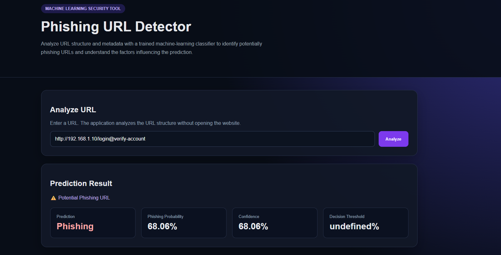
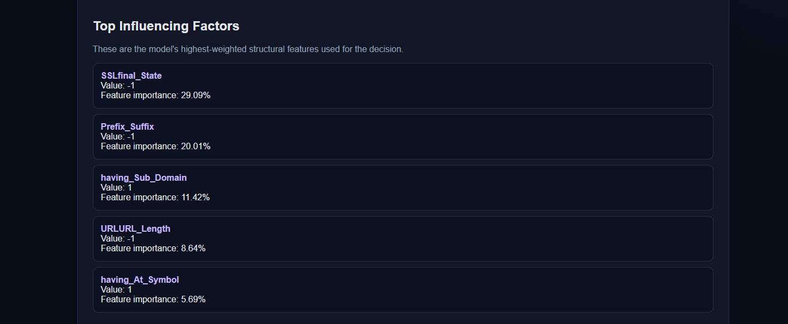
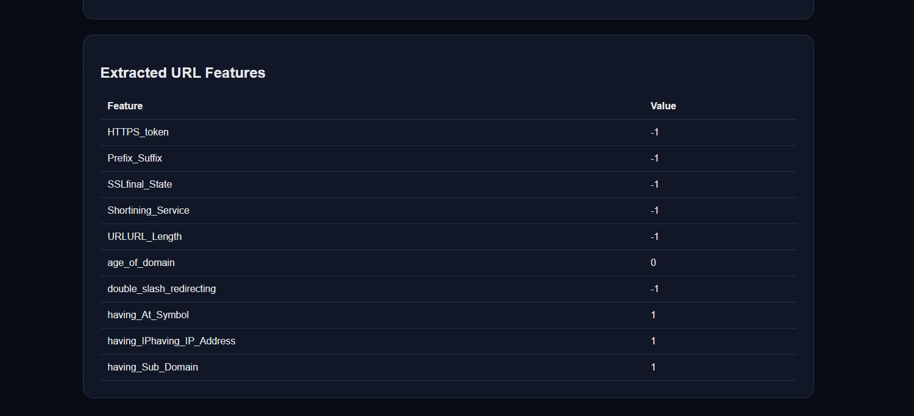

## Model Evaluation

Two machine-learning classifiers were trained and compared:

* Random Forest
* XGBoost

The models were evaluated using:

* Accuracy
* Precision
* Recall
* F1-Score
* Confusion Matrix

The final classifier is selected based on the F1-Score on the test set.

## Explainability

The web application displays the most influential URL features used by the trained model, helping users understand why a URL received a phishing or legitimate prediction.

Examples of analyzed features include:

* IP address presence
* URL length
* HTTPS usage
* `@` symbol
* Subdomain count
* URL shortening indicators
* Prefix/suffix patterns
* Domain-age-related information

## Dashboard Screenshots

### Prediction Result



### Model Explainability



### Extracted URL Features



## Project Workflow

```text
URL Input
   ↓
Feature Extraction
   ↓
Trained Machine Learning Model
   ↓
Phishing / Legitimate Prediction
   ↓
Probability + Confidence
   ↓
Feature Importance
